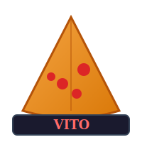
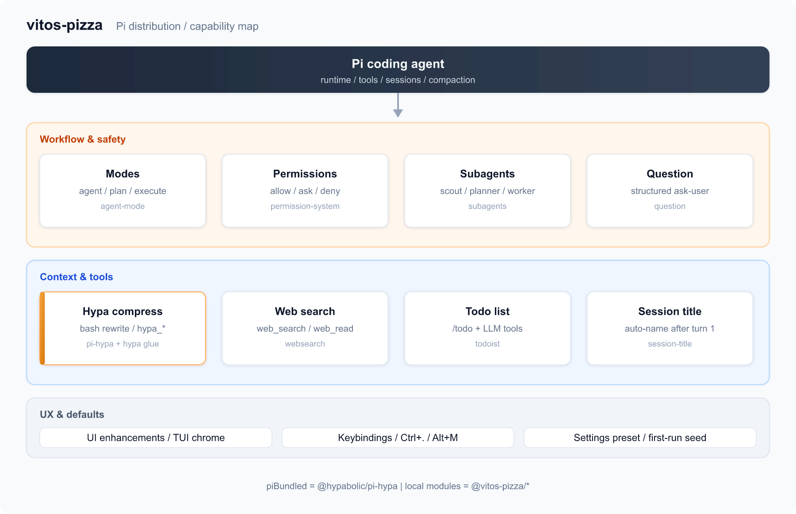

<p align="center">
  
  <br />
  <strong>维多披萨 · Vito's Pizzeria</strong>
  <br />
  <em>加菲猫同款 Pi 发行版 — 一次安装，开箱即用</em>
</p>

# vitos-pizza

**Vito's Pizzeria** is a personal [Pi](https://pi.dev/) distribution — like LazyVim for Neovim. One install gives you a curated set of extensions and workflows. Built on upstream Pi, not a fork.

Inspired by [Vito's Pizzeria](https://garfield.fandom.com/wiki/Vito_Cappelletti) from Garfield — Garfield's favorite pizza place.

## Architecture



Typical flow: **plan** → optional **scout** → **planner** → confirm → **execute** / **worker**. Shell output is compressed via Hypa bash rewrite; scout/planner/worker explore with `hypa_*` only (main session may still use builtin reads).

| Capability | Module | What you get |
|------------|--------|--------------|
| Modes | `@vitos-pizza/agent-mode` | `agent` / `plan` / `execute` — `/mode`, Ctrl+. / Alt+M |
| Permissions | `@vitos-pizza/permission-system` | allow / ask / deny presets per mode |
| Context compression | `@hypabolic/pi-hypa` + `@vitos-pizza/hypa` | bash rewrite, `hypa_*` tools, `/hypa` (MCP proxy off) |
| Subagents | `@vitos-pizza/subagents` | scout · planner · worker (+ title/commit internally) |
| Structured questions | `@vitos-pizza/question` | `question` tool |
| Web | `@vitos-pizza/websearch` | `web_search` / `web_read` |
| Tasks | `@vitos-pizza/todoist` | `/todo` + LLM tools |
| Git ship | `@vitos-pizza/git` | `/cp` `/bcp` |
| Session titles | `@vitos-pizza/session-title` | auto-name after first turn |
| TUI | `@vitos-pizza/ui-enhancements` | border status, execute prompt chrome |
| Shortcuts | `@vitos-pizza/keybindings` | centralized `vitos-shortcuts.json` |
| Defaults | `@vitos-pizza/settings-preset` | seed Pi settings on first session |

## Prerequisites

- Node.js >= 22.19.0
- [Pi](https://pi.dev/) installed globally:

```bash
npm install -g --ignore-scripts @earendil-works/pi-coding-agent
```

Context compression uses bundled [Hypa](https://github.com/Hypabolic/Hypa) (`@hypabolic/pi-hypa`). The matching platform binary comes from npm optionalDependencies (Linux / macOS / Windows, x64 / arm64). Use `/hypa` in a session for diagnostics. MCP proxy stays **off** (this distribution does not use MCP).

## Install

```bash
# npm (recommended)
pi install npm:@vitos-pizza/vitos-pizza@0.4.2

# git (pinned tag)
pi install git:github.com/xin2017338/vitos-pizza@v0.4.2
```

From source:

```bash
git clone https://github.com/xin2017338/vitos-pizza.git vitos-pizza
cd vitos-pizza
npm install

# Global Pi settings (~/.pi/agent/settings.json)
npm run install:pi
# or: pi install .

# Project-local settings (.pi/settings.json)
npm run install:pi:local
# or: pi install -l .

# Try without installing
npm run try:pi
# or: pi -e .
```

After install, start `pi`. Sessions are auto-titled from the first meaningful user message (see **Session auto-title** below). Delegate work with **subagents** (see below). When you change extension code, use `/reload`.

## Structure

```
vitos-pizza/                 # Pi distribution (install this)
├── assets/logo.svg
├── assets/architecture.svg  # editable capability map source
├── assets/architecture.png  # README preview (rendered from SVG)
├── package.json             # distro manifest + pi-package entry
├── AGENTS.md
└── packages/                # built-in modules (not installed separately)
    ├── ui-enhancements/     # @vitos-pizza/ui-enhancements — TUI display optimizations
    ├── agent-mode/          # @vitos-pizza/agent-mode — agent / plan / execute mode switching
    ├── permission-system/   # @vitos-pizza/permission-system — allow/ask/deny gates
    ├── settings-preset/     # @vitos-pizza/settings-preset — seed default Pi settings
    ├── hypa/                # @vitos-pizza/hypa — Hypa defaults (additive, no MCP proxy)
    ├── question/            # @vitos-pizza/question — structured ask-user question tool
    ├── session-title/       # @vitos-pizza/session-title — auto session naming
    ├── subagents/           # @vitos-pizza/subagents — scout/planner/worker delegation
    ├── websearch/           # @vitos-pizza/websearch — web_search / web_read tools
    ├── todoist/             # @vitos-pizza/todoist — in-memory task list + TUI widget
    ├── git/                 # @vitos-pizza/git — /cp /bcp quick commit+push
    └── keybindings/         # @vitos-pizza/keybindings — centralized shortcut bindings
```

Built-in modules are wired via `scripts/sync-pi-manifest.mjs` (supports `pi.requires` load order). Third-party Pi packages listed in root `piBundled` (currently `@hypabolic/pi-hypa`) are merged into the same manifest.

## Quick git commit & push

Module `@vitos-pizza/git` ships changes with an AI-written commit message (Pi session only):

| Command | What it does |
|---------|--------------|
| `/cp` | Commit message → confirm → commit + push |
| `/bcp` | Suggest branch + message → confirm → `checkout -b` → commit + `push -u` |

After `pi install .` (or `/reload`), use these from the Pi TUI. Never force-pushes; aborts on empty trees or likely secret paths (e.g. `.env`).

| Path | Role |
|------|------|
| Repo root | **The distribution** — `pi install .` |
| `packages/<module>/` | Built-in capability modules |
| `scripts/sync-pi-manifest.mjs` | Wires modules into the root pi manifest |

## Session auto-title

Built-in module `@vitos-pizza/session-title` names sessions asynchronously after the **first agent reply**:

- Waits for the first turn to finish, then summarizes user intent + assistant reply via the **subagents `title` agent** (RPC, not a direct LLM call)
- Title is ≤20 characters; trivial greetings are skipped via fast rules
- Runs in the background — does not block the main agent
- Optional dedicated model via `.pi/settings.json`; defaults to the current session model

Example settings (also in [`.pi/settings.example.json`](.pi/settings.example.json)):

```json
{
  "session": {
    "autoTitle": {
      "enabled": true,
      "model": "google/gemini-2.5-flash",
      "minCharsForLlm": 4,
      "fastRules": true
    }
  }
}
```

Use `/name` to override manually. See auto titles in `/resume`.

## Subagents & permissions

Built-in **@vitos-pizza/subagents** lets the main agent delegate via the `subagent` and `wait` tools:

```text
subagent({ agent: "scout", task: "map the auth module" })
subagent({ chain: [{ agent: "scout", task: "..." }, { agent: "planner", task: "plan from {previous}" }] })
subagent({ tasks: [{ agent: "scout", task: "scan src" }, { agent: "scout", task: "scan tests" }] })
subagent({ agent: "worker", task: "...", async: true })  →  wait({ id: "<runId>" })
```

Built-in agents: **scout**, **planner**, **worker**. Other modules request runs over `pi.events` RPC — import `requestSubagentRun` from `@vitos-pizza/subagents/rpc/client`.

## Web search

Built-in **@vitos-pizza/websearch** adds `web_search` and `web_read` tools. Works out of the box via Exa MCP and keyless Firecrawl — no API keys required for basic use.

```text
web_search({ query: "TypeScript 5.8 release notes" })
web_read({ url: "https://docs.example.com/guide" })
/search-status
```

Default backends: **Exa MCP** → **Firecrawl** → optional keyed providers. Configure globally at `~/.pi/agent/extensions/search.json` or per-project at `.pi/search.json` (see [`.pi/search.example.json`](.pi/search.example.json)).

Permissions: `web_search` and `web_read` are **ask** in `agent` and `plan` modes (subagent `ask` prompts forward to the parent session); **allow** in `execute` mode.

Do not install community search extensions (e.g. `pi-web-access`, `pi-search-hub`) alongside vitos-pizza — tool names would collide.

Built-in **@vitos-pizza/ui-enhancements** improves TUI readability: built-in tools use smart compact rendering (read-only `bash`/`grep`/`read` collapsed by default; `write`/`edit`/dangerous commands always show full output). Toggle expansion with `Ctrl+O`. Welcome header and border status bar are on by default (no settings required). Use `/vitos-ui` for status; `/builtin-header` restores Pi's built-in header.

Built-in **@vitos-pizza/permission-system** enforces allow / ask / deny on tools, bash, and paths. Child subagent `ask` prompts forward to the parent session UI automatically.

### Agent modes

`@vitos-pizza/agent-mode` provides three session-level modes. Switch with:

```text
/mode                         # interactive picker
/mode plan                    # or agent | execute
```

Or press **`Ctrl+.`** or **`Alt+M`** to cycle agent → plan → execute. Use `/vitos-shortcuts` to view bindings.

| Mode | Permissions | Behavior |
|------|-------------|----------|
| `agent` | `default` | Balanced — read/grep/find/ls allowed in the git repo; bash `ask` for other commands |
| `plan` | `plan` | Read-only — explore without edits or shell; `subagent` / `question` for scout/planner |
| `execute` | `yolo` | Minimal gates — only blocks `.env`, `~/.ssh`, `rm -rf` |

Current mode is shown in the border status bar (`· plan` / `· execute`). Mode is per session (new sessions start in `agent`); switching does not rewrite project permission config. On first session in a project, a `default` preset is written to `.pi/extensions/pi-permission-system/config.json` if missing. Use `/permission-system` for debug/YOLO runtime toggles. See [config.example.json](.pi/extensions/pi-permission-system/config.example.json).

Optional subagents settings in [`.pi/settings.example.json`](.pi/settings.example.json) (`subagents.disableThinking`, model overrides, etc.).

## Adding a module

1. Have AI (or you) create `packages/<name>/` with `package.json`, `extensions/`, etc.
2. Set `"name": "@vitos-pizza/<name>"` in the module's `package.json`.
3. Run:

```bash
npm run sync
npm install
pi install .   # or /reload in Pi
```

## Development

```bash
npm run sync         # Regenerate root pi manifest from packages/*
npm run typecheck
npm run lint
npm run lint:fix
```

Pi loads TypeScript extensions directly — no build step.

## Acknowledgments

vitos-pizza builds on the Pi ecosystem and several open-source projects. We are grateful to their authors and contributors.

**Convention:** any new feature, module, or dependency that references external open source must add a row here (see [AGENTS.md](AGENTS.md) → Open-source acknowledgments).

### Platform & distribution model

| Project | Role | Link |
|---------|------|------|
| **Pi** (`@earendil-works/pi-coding-agent`) | Agent runtime, extension API, and TUI — the foundation this distribution installs on top of | [pi.dev](https://pi.dev/) · [GitHub](https://github.com/earendil-works/pi) |
| **LazyVim** | Inspiration for the “one install, curated defaults” distribution model (Pi distribution ≈ LazyVim for Neovim) | [GitHub](https://github.com/LazyVim/LazyVim) |

### Features referenced or adapted

| Project | Used in | Notes |
|---------|---------|-------|
| [Pi official subagent example](https://github.com/earendil-works/pi/tree/main/packages/coding-agent/examples/extensions/subagent) | `@vitos-pizza/subagents` | Subprocess spawn, chain/parallel delegation, agent markdown discovery |
| [Pi official `question` example](https://github.com/earendil-works/pi/tree/main/packages/coding-agent/examples/extensions/question.ts) | `@vitos-pizza/question` | Structured ask-user UI (`ctx.ui.custom`); adapted with subagent parent-session forwarding |
| [@gotgenes/pi-permission-system](https://www.npmjs.com/package/@gotgenes/pi-permission-system) | `@vitos-pizza/permission-system` | Flat permission config format, preset modes, subagent prompt forwarding — reimplemented in-tree |
| [@ryan_nookpi/pi-extension-auto-name](https://www.npmjs.com/package/@ryan_nookpi/pi-extension-auto-name) | `@vitos-pizza/session-title` | Fire-and-forget async title via `completeSimple` |
| [djdembeck/pi-session-title](https://github.com/djdembeck/pi-session-title) | `@vitos-pizza/session-title` | Early community session naming patterns |
| [pi-subagents](https://pi.dev/packages/pi-subagents) (nicobailon) | Subagent design | Community reference when shaping chain/parallel UX |
| [pi-search-hub](https://github.com/ronnieops/pi-search-hub) | `@vitos-pizza/websearch` | Backend registry, config merge, auto-fallback dispatch, `/search-status` |
| [pi-web-access](https://github.com/nicobailon/pi-web-access) | `@vitos-pizza/websearch` | Zero-config Exa MCP default chain and tool prompt guidelines |
| [pi-web-search](https://github.com/ttttmr/pi-web-search) | `@vitos-pizza/websearch` | `session_start` config refresh lifecycle pattern |
| [Pi `minimal-mode` / `built-in-tool-renderer` examples](https://github.com/earendil-works/pi/tree/main/packages/coding-agent/examples/extensions) | `@vitos-pizza/ui-enhancements` | Compact built-in tool rendering and smart bash collapse |
| [Virgil-Bulens minimal-mode gist](https://gist.github.com/Virgil-Bulens/4d9d747ef85709b0850fc5aa01a6a4ef) | `@vitos-pizza/ui-enhancements` | Read-only bash whitelist and session collapsed-by-default UX |
| [pi-statusbar](https://github.com/BumpyClock/pi-statusbar) | `@vitos-pizza/ui-enhancements` | Welcome header layout and loaded-counts information architecture |
| [pi-powerline-footer](https://github.com/nicobailon/pi-powerline-footer) | `@vitos-pizza/ui-enhancements` | Welcome panel design and recent-sessions discovery |
| [Pi `border-status-editor` example](https://github.com/earendil-works/pi/tree/main/packages/coding-agent/examples/extensions/border-status-editor.ts) | `@vitos-pizza/ui-enhancements` | Editor-border status bar (model, thinking, context, cwd, git) |
| [sf-welcome](https://github.com/salesforce/sf-pi/blob/main/extensions/sf-welcome/index.ts) | `@vitos-pizza/ui-enhancements` | Welcome header session lifecycle and tips layout |
| **Claude Code** permission UX | Agent modes (`agent` / `plan` / `execute`) | Preset naming and mode-switching inspiration (not a code dependency) |
| [Claude Code system prompts](https://github.com/CANYOUFINDIT/claude-code-system-prompts) (plan-mode reminders) | `@vitos-pizza/agent-mode` plan instructions | Short sticky reminder + supersede pattern for plan mode (not a code dependency) |
| [OpenAI Codex base instructions](https://github.com/openai/codex/blob/main/codex-rs/protocol/src/prompts/base_instructions/default.md) | Plan / subagent prompt style | Concise hard rules and precedence over conflicting guidance (not a code dependency) |
| [Claude Code TodoWrite / Task tools](https://code.claude.com/docs/en/agent-sdk/todo-tracking.md) | `@vitos-pizza/todoist` | Complete = status done; delete only when no longer relevant (cancelled / mistaken) |
| [@capyup/pi-basic-tools todo](https://www.npmjs.com/package/@capyup/pi-basic-tools) | `@vitos-pizza/todoist` | completed vs deleted prompt boundary for task-list tools |
| [pi-package-template](https://github.com/S1M0N38/pi-package-template) | Repo layout | Pi package monorepo conventions |
| [Hypa](https://github.com/Hypabolic/Hypa) (`@hypabolic/pi-hypa`) | `@vitos-pizza/hypa` + distro bundle | Additive bash rewrite / `hypa_*` tools; MCP proxy off (FSL-1.1-ALv2) |

### Runtime & tooling libraries

| Library | Used in | Link |
|---------|---------|------|
| [tree-sitter-bash](https://github.com/tree-sitter/tree-sitter-bash) + [web-tree-sitter](https://github.com/tree-sitter/tree-sitter) | `@vitos-pizza/permission-system` | Bash command parsing for permission gates |
| [Zod](https://github.com/colinhacks/zod) | `@vitos-pizza/permission-system` | Config validation |
| [Biome](https://biomejs.dev/) | Dev tooling | Lint and format |
| [Vitest](https://vitest.dev/) | Tests | Unit and integration tests |
| [TypeScript](https://www.typescriptlang.org/) | All packages | Type checking |

If we missed a project you rely on, please open an issue or PR — we want to credit every upstream contribution properly.

## License

MIT
